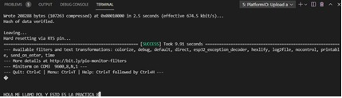

Pol Naharro
## PRACTICA 8 : Buses de comunicación IV(uart)

##### Código Ejercicio Practico 1  bucle de comunicacion uart2:

```
#include <Arduino.h>

void setup() {

  Serial.begin(9600);
  Serial2.begin(9600);
}

void loop() {
  if(Serial.available()){
    Serial2.write(Serial.read());
    
    delay(2);
    
    if(Serial2.available()){
      Serial.write(Serial2.read());
    } 
  }
}
```
##### Explicación:

La práctica 8 consiste en hacer un programa que el usuario escriba con el teclado y el programa te lo muestre en el monitor. Para ello primero inicializamos dos serials (Serial y Serial2) a una velocidad de 9600. Después en el loop creamos un if que nos indique que si el primero está disponible que lo que se lea en el Serial se escriba en el Serial2. Y luego hacemos otro if dentro de este que si el Serial2 está disponible se escriba lo que está dentro de este por pantalla, es decir que se escriba en el Serial.

##### Funcionamiento de la práctica:

Comprobación:


